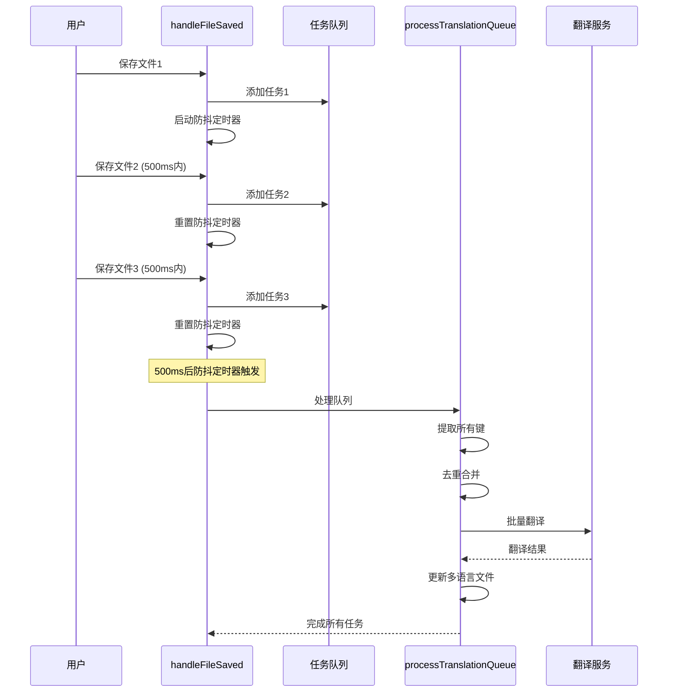

# 并发翻译处理机制

## 问题背景

在之前的版本中，当用户快速保存多个文件时（例如使用 Ctrl+S 或 Cmd+S 快速保存），可能会出现以下问题：

1. **翻译任务重叠**：多个文件同时触发翻译，导致并发访问同一个多语言文件
2. **内容遗漏**：由于文件读写冲突，可能导致某些翻译内容丢失
3. **资源浪费**：重复的翻译请求增加了 API 调用成本
4. **用户体验差**：多个状态栏消息同时显示，界面混乱

## 解决方案

### 1. 任务队列机制

新版本实现了基于队列的翻译任务管理：

```typescript
interface TranslationTask {
  id: string;                    // 任务唯一标识
  document: vscode.TextDocument; // 文档对象
  resolve: () => void;           // 成功回调
  reject: (error: any) => void;  // 失败回调
}
```

### 2. 防抖机制

- **防抖延迟**：500ms
- **工作原理**：在 500ms 内的多次保存操作会被合并为一次批量处理
- **优势**：减少不必要的翻译请求，提高处理效率

### 3. 批量翻译

- **键去重**：自动去除重复的翻译键
- **批量处理**：将多个文件中的翻译键合并后一次性处理
- **原子操作**：确保所有相关的多语言文件同时更新

## 实现细节

### 核心流程



### 关键特性

1. **线程安全**：使用 `isProcessing` 标志防止并发处理
2. **错误隔离**：单个文件的错误不会影响其他文件的处理
3. **状态管理**：统一的状态栏消息显示
4. **资源优化**：减少重复的 API 调用

## 配置选项

可以通过以下配置调整并发处理行为：

```json
{
  "ut-auto-translate.translationMode": "auto",  // 翻译模式
  "ut-auto-translate.enabled": true,           // 是否启用
  "ut-auto-translate.languages": [             // 目标语言
    "zh-CN", "en-US", "es-ES", "fr-FR", "zh-TW"
  ]
}
```

## 性能优化

### 防抖延迟调整

如果需要调整防抖延迟时间，可以修改 `DEBOUNCE_DELAY` 常量：

```typescript
// 在 AutoTranslateService 类中
private static readonly DEBOUNCE_DELAY = 500; // 毫秒
```

### 批量大小优化

翻译服务中的批量大小可以根据 API 限制进行调整：

```typescript
// 在 TranslationService 类中
const batchSize = 10; // 每批处理的键数量
```

## 测试验证

### 并发测试

运行以下测试来验证并发处理机制：

```bash
npm test -- --testNamePattern="并发测试"
```

### 手动测试

1. 创建多个包含 `intl.t()` 调用的文件
2. 快速连续保存这些文件（在 500ms 内）
3. 观察状态栏消息和多语言文件更新
4. 验证所有翻译键都被正确处理

## 故障排除

### 常见问题

1. **翻译延迟**：正常现象，防抖机制会延迟 500ms
2. **部分键未翻译**：检查是否在忽略列表中
3. **API 调用失败**：检查网络连接和 API 密钥

### 调试信息

启用详细日志来调试问题：

```typescript
// 在控制台中查看详细日志
console.log('翻译队列状态:', this.translationQueue.length);
console.log('正在处理:', this.isProcessing);
```

## 版本兼容性

- **向后兼容**：新机制完全兼容现有配置
- **API 不变**：`handleFileSaved` 方法签名保持不变
- **配置兼容**：所有现有配置选项继续有效

## 未来改进

1. **智能批量**：根据文件大小和键数量动态调整批量大小
2. **优先级队列**：为不同类型的文件设置不同的处理优先级
3. **缓存机制**：缓存最近的翻译结果，减少重复翻译
4. **进度显示**：显示详细的翻译进度信息